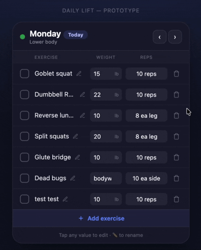
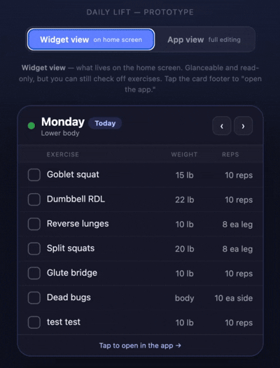

# 1 - Prototype

The live, interactive prototype: a working mockup of the idea, built iteratively with AI.

`workout-widget-prototype.html` is the **final prototype** and the design source of truth that gets handed to the team review in `../2-team-review/`. It is a single, self-contained HTML file with no dependencies. Open it in any browser (desktop or mobile) to try it.

It demonstrates the full concept:

- Auto-switches to today's workout, with manual day navigation
- A toggle between **widget view** (glanceable, read-only, but you can check off exercises) and **app view** (full editing)
- Inline editing of weights and reps, renaming, and adding or removing exercises
- A detail popup with a plain-language form tip for each exercise
- Completion tracking that resets daily, with an encouraging message when all exercises are done
- A rest-day screen on weekends
- Edits saved locally so they persist between sessions

## How this prototype evolved

The two HTML files in this folder show a real product decision being made, which is part of the process this repo is meant to make visible:
- `prototype-testing-edits.html` is the **original version**, where all editing happened directly inside the widget itself: you could change weights, reps, and exercises right on the home screen surface.

- `workout-widget-prototype.html` is the **refined final**, which splits the experience into a read-mostly **widget view** and a fully editable **app view**.

The change wasn't cosmetic, it was a platform-fit call. A real Android home screen widget can't take text input, so a fully editable widget was both a heavy technical ask and the wrong model for the platform. The right design keeps the widget glanceable (view plus the one daily action worth having there, checking an exercise off) and moves all editing into the app it opens. That widget-versus-app split became one of the core product decisions the later stages build on, so keeping both files makes the reasoning legible: the first instinct, the realization that it fought the platform, and the version that matches how widgets actually work.
