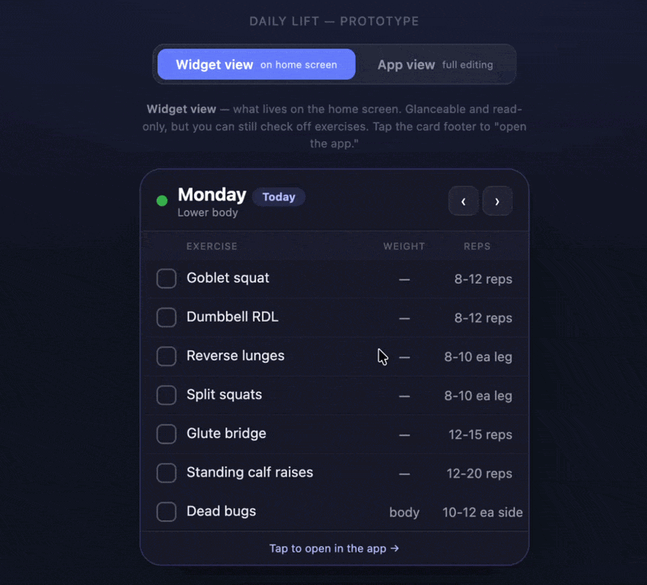

# Daily Lift

**A learning project demonstrating an AI-assisted product workflow - taking an idea from concept to a working prototype, through a multi-perspective team review, to a scoped build, using AI tools throughout.**

The product itself is a home-workout app for beginners (the vehicle). The focus of this repo is the *process*: how a PM can drive an idea to execution by directing AI tools - including the engineering work - rather than writing the code by hand.



---

## The process, in three stages

This repo is organized around the lifecycle, so the process is visible at a glance:

| Stage | Folder | What's in it |
|-------|--------|--------------|
| **1 - Prototype** | [`1-prototype/`](./1-prototype/) | The live, interactive HTML prototype - a working mockup of the idea, built iteratively with AI. Open it in any browser. |
| **2 - Team review** | [`2-team-review/`](./2-team-review/) | A structured, multi-role review (engineer, QA, designer, accessibility, a beginner-user voice, and more) that stress-tests the prototype and hardens the plan before any code is written. |
| **3 - Build** | [`3-build/`](./3-build/) | The actual work to build the MVP - the native Android app and home screen widget - through to an installable result. In progress. |

Supporting context lives in [`docs/`](./docs/): a brief [discovery note](./docs/DISCOVERY.md) and a running [build log](./docs/BUILD-LOG.md).

## What this project demonstrates

- Driving an AI-assisted workflow from idea → prototype → review → build
- Recognizing when an approach isn't working and redirecting quickly
- Orchestrating multiple perspectives (a simulated cross-functional team) to pressure-test a plan
- Making deliberate scope and tradeoff decisions, and recording them
- Directing AI tools through the engineering, rather than writing code by hand

## The product (the vehicle)

A calm, supportive weekly workout routine for beginners - women working out at home who are new to exercise - that stays **visible at a glance** as a home screen widget, with **plain-language form guidance** so each exercise is actually understandable.

Core features (all demonstrated in the prototype):

- A different workout for each weekday, with rest days on weekends
- Editable weights and reps (they change week to week)
- Add, rename, and remove exercises
- Check off completed exercises, with a daily reset
- Plain-language form tips for each exercise (visuals planned for a later version)
- All data saved locally on the device - no account, no cloud

## Two views: widget and app

A key design decision is the split between what lives on the home screen and what lives in the app. The prototype demonstrates both via a toggle:

- **Widget view** - what sits on the home screen. Glanceable and read-only, but you can still check off exercises. Tapping it opens the app.
- **App view** - opens when you tap the widget. Full editing: tap a value to type, rename exercises, add or remove them.

This split matches the platform: home screen widgets can't take text input, so all editing belongs in the app, while the widget stays fast and glanceable.

## Try the prototype

[`1-prototype/workout-widget-prototype.html`](./1-prototype/workout-widget-prototype.html) is a fully working, self-contained prototype - open it in any browser (desktop or mobile). It's a single HTML file with no dependencies, built iteratively with AI.

## Key product decisions (and why)

- **Native, not a wrapped web app** - because the home screen widget is central to the concept.
- **Widget is read-mostly** - viewing and checking off live on the widget; all typing-based editing lives in the app, matching the platform rather than fighting it.
- **Text form tips for v1, visuals for v2** - keeps the first version shippable.
- **Local storage only** - no accounts, no servers, no ongoing cost.
- **Standard resizable widget sizes** - the user picks what fits their home screen.

## Repository structure

```
daily-lift/
├── README.md
├── docs/
│   ├── DISCOVERY.md                            # Brief discovery note
│   └── BUILD-LOG.md                            # Running process journal
├── 1-prototype/
│   ├── workout-widget-prototype.html           # The live prototype - open in a browser
│   └── README.md
├── 2-team-review/
│   ├── stage2-team-review-prompt.md            # Multi-role review prompt
│   └── README.md
├── 3-build/
│   ├── stage3-build-prompt-DRAFT.md            # Draft build plan (input to the review)
│   └── README.md
└── images/
    └── prototype-demo.gif                      # Screen recording of the prototype
```

## Status

Prototype complete and tested. Team review prompt ready. Build not yet started.
